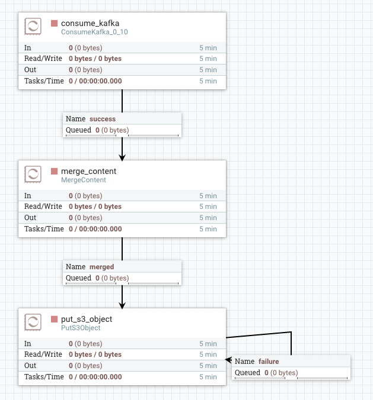

# Terraform NiFi Provider

The NiFi provider is used to interact with NiFi cluster.
It aims to make flow deployment and maintenance completely automated process.

  

## Documentation

- [Provider Syntax](docs/syntax.md)
- [Changelog](docs/changelog.md)

## Plugin Requirements

- Terraform 0.9

## NiFi Version Compatibility

Plugin Version | Supported NiFi API Version
---|---
0.1-0.3 | 1.1, 1.2 (not confirmed)
0.4+ | 1.3+

## References

- [Apache NiFi](https://nifi.apache.org/)
- [Terraform by HashiCorp](https://www.terraform.io/)
- [NiFi API Documentation](https://nifi.apache.org/docs/nifi-docs/rest-api/)

## Contributors

- [Egor Pushkin](https://www.linkedin.com/in/egorpushkin/) | [egor@glympse.com](mailto:egor@glympse.com)
- Josh Hardy | [josh@glympse.com](mailto:josh@glympse.com>)
- Thibaut Colar | [tcolar@colar.net](mailto:tcolar@colar.net)

## License

Code is licensed under the [The MIT License](http://opensource.org/licenses/MIT).  
Documentation is licensed under [Creative Commons Attribution 4.0 International License](https://creativecommons.org/licenses/by/4.0/).
